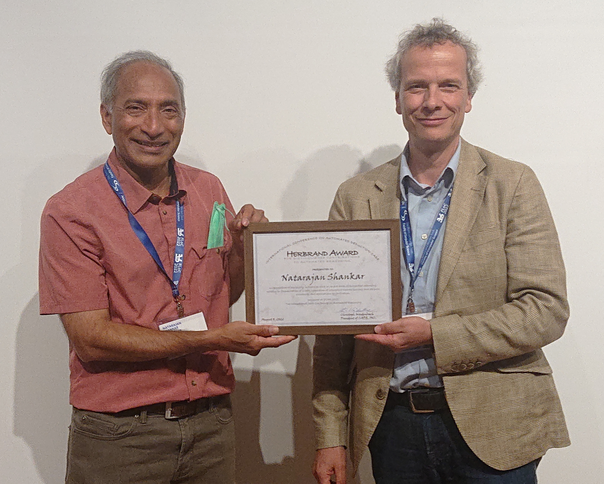
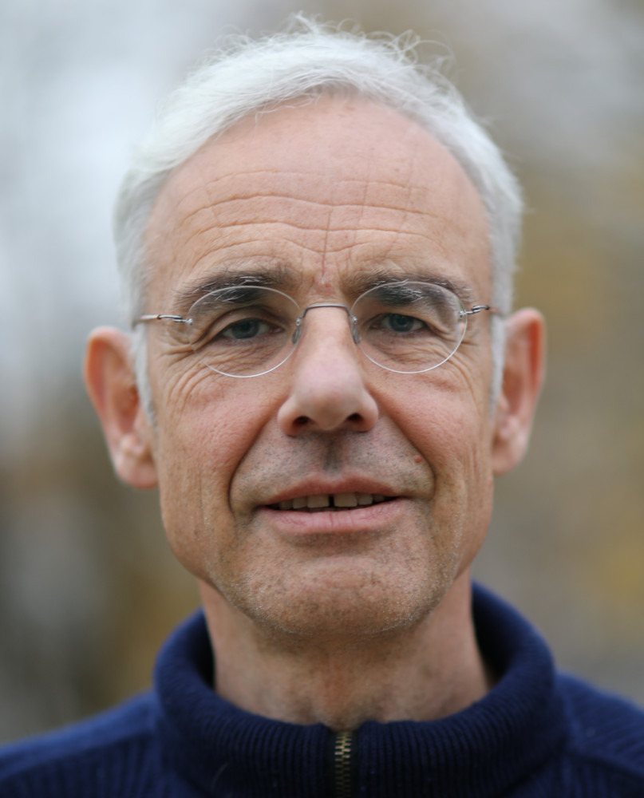
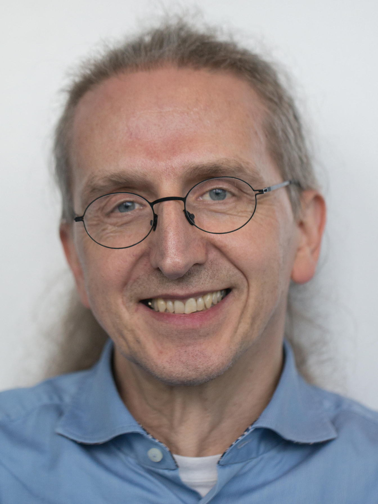
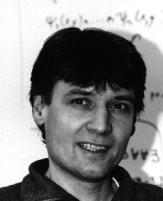
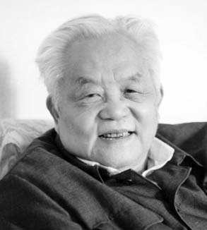



In 1992 CADE Inc. established the Herbrand Award for Distinguished Contributions to Automated Reasoning, to honor an individual or (a group of) individuals for exceptional contributions to the field of Automated Deduction. Nominations for this award can be made at any time to the president of CADE Inc.

### Winners

 - [Natarajan Shankar](http://www.csl.sri.com/people/shankar/) (2022)
 - [Tobias Nipkow](https://www21.in.tum.de/~nipkow/) (2021)
 - [Franz Baader](https://tu-dresden.de/ing/informatik/thi/lat/die-professur/franz-baader) (2020)
 - [Nikolaj Bj&oslash;rner](https://www.microsoft.com/en-us/research/people/nbjorner/) and [Leonardo de Moura](https://www.microsoft.com/en-us/research/people/leonardo/?from=http%3A%2F%2Fresearch.microsoft.com%2Fen-us%2Fum%2Fpeople%2Fleonardo%2Fz3_doc%2Fgroup__z3native.html) (2019)
 - [Bruno Buchberger](http://www.risc.jku.at/people/buchberger/) (2018)
 - [Lawrence C. Paulson](http://www.cl.cam.ac.uk/~lp15/) (2017)
 - [Zohar Manna](http://theory.stanford.edu/~zm/) and [Richard Waldinger](http://www.ai.sri.com/~waldinge/) (2016)
 - [Andrei Voronkov](http://voronkov.com/) (2015)
 - [Robert L. Constable](http://www.cs.cornell.edu/home/rc/) (2014)
 - Greg Nelson (2013)
 - [Melvin Fitting](http://comet.lehman.cuny.edu/fitting/) (2012)
 - [Nachum Dershowitz](http://www.cs.tau.ac.il/~nachum/nachumd/Homepage.html) (2011)
 - [David Plaisted](http://www.cs.unc.edu/~plaisted/) (2010)
 - [Deepak Kapur](http://www.cs.unm.edu/~kapur/) (2009)
 - [Edmund Clarke](http://www.cs.cmu.edu/~emc/) (2008)
 - [Alan Bundy](http://homepages.inf.ed.ac.uk/bundy/) (2007)
 - [Wolfgang Bibel](http://www.intellektik.de/index/WolfgangBibel.htm) (2006)
 - [Martin Davis](http://www.cs.nyu.edu/cs/faculty/davism/) (2005)
 - [Harald Ganzinger](http://www.mpi-sb.mpg.de/~hg/) (2004)
 - [Peter B. Andrews](http://gtps.math.cmu.edu/andrews.html) (2003)
 - [Mark E. Stickel](http://www.ai.sri.com/~stickel/) (2002)
 - [Donald Loveland](http://www.cs.duke.edu/~dwl/) (2001)
 - [William W. McCune](http://www-unix.mcs.anl.gov/~mccune/) (2000)
 - [Robert S. Boyer](http://www.cs.utexas.edu/users/boyer/) and [J Strother Moore](http://www.cs.utexas.edu/users/moore/) (1999)
 - [Gérard Huet](http://pauillac.inria.fr/~huet/) (1998)
 - [Wen-Tsun Wu](http://www.mmrc.iss.ac.cn/~wtwu/) (1997)
 - J. Alan Robinson (1996)
 - Woody Bledsoe (1994)
 - [Larry Wos](http://www-unix.mcs.anl.gov/~wos/) (1992)

--------

### Procedure

The Herbrand award procedure (established 1992, amended 2001, updated 2019) 
has two stages: nomination and decision by the Herbrand award committee.
Nominations for this award can be made at any time to the president of CADE 
Inc. 
A nomination should include a letter (up to 2000 words) from a principal 
nominator describing the nominee's contributions (including the relationship 
to CADE), along with two other letters (up to 2000 words) of endorsement. 
Current members of the board of trustees of CADE Inc. (including ex-officio 
members) are not eligible. 
The nomination of a group of individuals who are collaborators is considered 
to be a single nomination, but all members of the group must be eligible. 
Nominations will be kept confidential.

The CADE trustees establish the Herbrand award committee. 
It is published upon its formation.
Nominators, nominees and authors of endorsement letters are not eligible for 
membership in the Herbrand award committee. 
The Herbrand award committee decides on the award.

------------------------

### Citations

--------

The International Conference on Automated Deduction (CADE) Herbrand Award for Distinguished Contributions to Automated Reasoning is presented to

	
	 
	<b>Natarajan Shankar</b>

in recognition of his highly influential work in several areas of automated reasoning, notably in 
formalization of proofs, cooperation of interactive theorem proving and decision procedures, and 
applications to verification."

Presented at IJCAR 2022, the 11th International Joint Conference on Automated Reasoning.

Franz Baader 
On behalf of the 2021 Herbrand Award Committee 
(Franz Baader (Chair), Pascal Fontaine, Radu Iosif, Silvio Ghilard)

--------

The International Conference on Automated Deduction (CADE) Herbrand Award for Distinguished Contributions to Automated Reasoning is presented to

	
	 
	<b>Tobias Nipkow</b>

in recognition of his leadership in developing Isabelle and related tools,
resulting in key contributions to the foundations, automation, and use of
proof assistants in a wide range of applications, as well as his
successful efforts in increasing the visibility of automated reasoning.

Presented at CADE-28, the 28th International Conference on Automated Deduction.

J&uuml;rgen Giesl 
On behalf of the 2021 Herbrand Award Committee 
(J&uuml;rgen Giesl (chair), Deepak Kapur, Laura Kovacs, Brigitte Pientka)

--------

The International Conference on Automated Deduction (CADE) Herbrand Award for Distinguished Contributions to Automated Reasoning is presented to

	
	 
	<b>Franz Baader</b>
	 <a href="./Data/HerbrandAwardSlidesBaader.pdf">Acceptance Speech</a>

in recognition of his significant contributions to unification theory, 
combinations of theories and reasoning in description logics.

Presented at IJCAR 2020, the 10th International Joint Conference on Automated Reasoning.

Andrei Vorokov 
On behalf of the 2020 Herbrand Award Committee 
(Andrei Voronkov (Chair), Chris Lynch, Robert Nieuwenhuis, Stephan Schulz)

--------

The International Conference on Automated Deduction (CADE) Herbrand Award for Distinguished Contributions to Automated Reasoning is presented to

	
	 
	<b>Nikolaj Bj&oslash;rner and Leonardo de Moura</b>

in recognition of their numerous and important contributions to SMT solving, 
including its theory, implementation, and application to a wide range of 
academic and industrial needs.

Presented at CADE-27, the 27th International Conference on Automated Deduction.

J&uuml;rgen Giesl 
On behalf of the 2019 Herbrand Award Committee 
(Dale Miller (Chair), Bruno Dutetre, J&uuml;rgen Giesl, Larry Paulson)

--------

The International Conference on Automated Deduction (CADE) Herbrand Award for Distinguished Contributions to Automated Reasoning is presented to

	
	 
	<b>Bruno Buchberger</b>

for the invention, implementation, and analysis of the Gr&ouml;bner-basis 
method, resulting in the reshaping of symbolic computation towards 
comprehensive and widely applicable tools.

Presented at IJCAR 2018, the 9th International Joint Conference on Automated Reasoning July, 2018.

Christoph Weidenbach 
President of CADE Inc.

--------

The International Conference on Automated Deduction (CADE) Herbrand Award for Distinguished Contributions to Automated Reasoning is presented to

	
	 
	<b>Lawrence C. Paulson</b>

for his pioneering contributions to
the automation in proof assistants and
the foundations of formal security protocol verification
as well as his impressive formalizations of deep mathematical theories.

Presented at CADE-26, the 26th International Conference on Automated Deduction.

Christoph Weidenbach 
President of CADE Inc.

--------

The International Conference on Automated Deduction (CADE) Herbrand Award for Distinguished Contributions to Automated Reasoning is presented to

	
	 
	<b>Zohar Manna</b>

for his pioneering research and pedagogical contributions (with Richard Waldinger) to automated reasoning, program synthesis, planning, and formal methods. 

Presented at IJCAR 2016, the 8th International Joint Conference on Automated Reasoning June, 2016

Maria Paola Bonacina 
President of CADE Inc.

--------

The International Conference on Automated Deduction (CADE) Herbrand Award for Distinguished Contributions to Automated Reasoning is presented to

	
	 
	<b>Richard Waldinger</b>
	 <a href="./Data/HerbrandAwardSlidesWaldinger.pdf">Acceptance Speech</a>

for his pioneering research and pedagogical contributions (with Zohar Manna) to automated reasoning, program synthesis, planning, and formal methods. 

Presented at IJCAR 2016, the 8th International Joint Conference on Automated Reasoning June, 2016.

Maria Paola Bonacina 
President of CADE Inc.

--------

The International Conference on Automated Deduction (CADE) Herbrand Award for Distinguished Contributions to Automated Reasoning is presented to

	
	 
	<b>Andrei Voronkov</b>

in recognition of his numerous theoretical and practical contributions to automated deduction, and the development of the award-winning Vampire theorem prover. 

Presented at CADE-25 The 25th International Conference on Automated Deduction August, 2015

Maria Paola Bonacina 
President of CADE Inc.

--------

The International Conference on Automated Deduction (CADE) Herbrand Award for Distinguished Contributions to Automated Reasoning is presented to

	
	 
	<b>Robert L. Constable</b>
	 <a href="./Data/HerbrandAwardSlidesConstable.pdf">Acceptance Speech</a>

in recognition of his pioneering research in automated reasoning, including his seminal contributions to the foundations of computational type theory, the creation of Nuprl - the first constructive type theory based theorem prover - the development of the correct-by-construction programming paradigm, and their applications to verification and synthesis of computer systems, including distributed computing. 

Presented at IJCAR 2014 The 7th International Joint Conference on Automated Reasoning July, 2014

Maria Paola Bonacina 
President of CADE Inc.

--------

The International Conference on Automated Deduction (CADE) Herbrand Award for Distinguished Contributions to Automated Reasoning is presented to

	
	 
	<b>Greg Nelson</b>

for his pioneering contributions to theorem proving and program verification, such as his seminal work with Derek Oppen on the combination of satisfiability procedures and fast congruence closure algorithms, the development of the highly influential theorem prover Simplify, and his role in the creation of the field of extended static checking. 

Presented at CADE-24 The 24th International Conference on Automated Deduction June, 2013

Franz Baader 
President of CADE Inc.

--------

The International Conference on Automated Deduction (CADE) Herbrand Award for Distinguished Contributions to Automated Reasoning is presented to

	
	 
	<b>Melvin C. Fitting</b>
	 <a href="./Data/HerbrandAwardSlidesFitting.pdf">Acceptance Speech</a>

in recognition of his outstanding contributions to tableau-based theorem proving in classical and non-classical logics, as well as to many other areas of Automated Reasoning, Logic Programming, and Philosophical Logic. 

Presented at IJCAR 2012 The 6th International Joint Conference on Automated Reasoning June 26, 2012

Franz Baader 
President of CADE Inc.

--------

The International Conference on Automated Deduction (CADE) Herbrand Award for Distinguished Contributions to Automated Reasoning is presented to

	
	 
	<b>Nachum Dershowitz</b>
	 <a href="./Data/HerbrandAwardSlidesDershowitz.pdf">Acceptance Speech</a>

in recognition of his ground-breaking research on the design and use of well-founded orderings in term rewriting and automated deduction. 

Presented at CADE 2011 The 23rd International Conference on Automated Deduction August 2, 2011

Franz Baader 
President of CADE Inc.

--------

The International Conference on Automated Deduction (CADE) Herbrand Award for Distinguished Contributions to Automated Reasoning is presented to

	
	 
	<b>David A. Plaisted</b>
	 <a href="./Data/HerbrandAwardSlidesPlaisted.pdf">Acceptance Speech</a>

in recognition of his numerous seminal contributions to several areas of automated reasoning, including first-order theorem proving, term rewriting, completion, orderings, inductive reasoning, and pioneering research on abstraction, instance-based methods and search complexity in theorem proving. 

Presented at IJCAR 2010 The 5th International Joint Conference on Automated Reasoning July 19, 2010

Maria Paola Bonacina 
President of CADE Inc.

--------

The International Conference on Automated Deduction (CADE) Herbrand Award for Distinguished Contributions to Automated Reasoning is presented to

	
	 
	<b>Deepak Kapur</b>

in recognition of of his seminal contributions to several areas of automated deduction including inductive theorem proving, geometry theorem proving, term rewriting, unification theory, integration and combination of decision procedures, lemma and loop invariant generation, as well as his work in computer algebra, which helped to bridge the gap between the two areas. 

Presented at CADE-22 The 22nd International Conference on Automated Deduction August 5, 2009

Reiner Hähnle 
Vice-president of CADE Inc.

--------

The International Conference on Automated Deduction (CADE) Herbrand Award for Distinguished Contributions to Automated Reasoning is presented to

	
	 
	<b>Edmund M. Clarke</b>

in recognition of his role in the invention of model checking and his sustained leadership in the area for more than two decades. 

Presented at IJCAR 2008 The 4th International Joint Conference on Automated Reasoning August 13, 2008

Franz Baader 
President of CADE Inc.

--------

The International Conference on Automated Deduction (CADE) Herbrand Award for Distinguished Contributions to Automated Reasoning is presented to

	
	 
	<b>Alan Bundy</b>
	 <a href="./Data/HerbrandAwardSlidesBundy.pdf">Acceptance Speech</a>

in recognition of his outstanding contributions to proof planning and inductive theorem proving, as well as to many other areas of Automated Reasoning and Artificial Intelligence. 

Presented at CADE-21 The 21st International Conference on Automated Deduction July 17, 2007

Franz Baader 
President of CADE Inc.

--------

The International Conference on Automated Deduction (CADE) Herbrand Award for Distinguished Contributions to Automated Reasoning is presented to

	
	 
	<b>Wolfgang Bibel</b>
	 <a href="./Data/HerbrandAwardSlidesBibel.pdf">Acceptance Speech</a>

in recognition of his seminal work on first order theorem proving and its applications in Artificial Intelligence and Programming. His research on the connection method laid the foundations for many modern deduction systems, and it had signifcant influence on other research areas such as Logic Programming, Knowledge Representation, and Deductive Planning.

Presented at IJCAR 2006 The International Joint Conference on Automated Reasoning August 19, 2006

Franz Baader 
President of CADE Inc.

--------

The International Conference on Automated Deduction (CADE) Herbrand Award for Distinguished Contributions to Automated Reasoning is presented to

	
	 
	<b>Martin Davis</b>

in recognition of his role as a founding father of the field of automated reasoning; coauthor of both papers that introduce what is now called the Davis-Putnam or Davis-Putnam-Logemann-Loveland procedure, variants of one of the most outstanding and useful proof procedures known today; historian regarding the early history of the field of automated deduction; and his numerous other contribution to the field. 

Presented at CADE-20 The Twentieth International Conference on Automated Deduction July 26, 2005

Franz Baader 
President of CADE Inc.

--------

The International Conference on Automated Deduction (CADE) Herbrand Award for Distinguished Contributions to Automated Reasoning is presented to

	
	 
	<b>Harald Ganzinger</b>

in recognition of his seminal work on the theory underlying modern theorem proving systems; the breadth of his research covering nearly all major areas of deduction, and the depth of his results in each one of them; his effective contributions to the development of systems and implementation techniques; and his dedicated promotion of automated reasoning both inside and outside the community. 

Presented at IJCAR-2004 The 2nd International Joint Conference on Automated Reasoning July 2004

Frank Pfenning 
President of CADE Inc.

--------

The International Conference on Automated Deduction (CADE) Herbrand Award for Distinguished Contributions to Automated Reasoning is presented to

	
	 
	<b>Peter Andrews</b>
	 <a href="./Data/HerbrandAwardSlidesAndrews.pdf">Acceptance Speech</a>

for his seminal contributions and pioneering research in type theory, mating-based theorem proving, automated deduction in higher-order logic, proof presentation, logic education, and many other contributions to the field of automated reasoning.
presented at CADE-19 The Nineteenth International Conference on Automated Deduction August 1, 2003

Ulrich Furbach 
President of CADE Inc.

--------

The International Conference on Automated Deduction (CADE) Herbrand Award for Distinguished Contributions to Automated Reasoning is presented to

	
	 
	<b>Mark E. Stickel</b>

for his ground-breaking discoveries in AC-unification, reasoning modulo a theory, term indexing, and thorough development of the SNARK and PTTP provers, as well as many other contributions to the field of automated reasoning presented at CADE-18 The Eighteenth International Conference on Automated Deduction July 29, 2002

Ulrich Furbach 
President of CADE Inc.

--------

The International Conference on Automated Deduction (CADE) Herbrand Award for Distinguished Contributions to Automated Reasoning is presented to

	
	 
	<b>Donald Loveland</b>

for his development of the model elimination procedure, for his contributions to propositional satisfiability testing realized in the Davis-Putman-Logemann-Loveland-Procedure, for his work on the nearHorn-Prolog family of calculi for disjunctive logic programming, and many other contributions to the field of automated reasoning. 

Presented at
IJCAR-2001 The First International Joint Conference on Automated Reasoning June 19, 2001

Ulrich Furbach 
President of CADE Inc.

--------

The International Conference on Automated Deduction (CADE) Herbrand Award for Distinguished Contributions to Automated Reasoning is presented to

	
	 
	<b>William W. McCune</b>

for his development of powerful and portable automated deduction tools, including ITP, LMA, OTTER, ROO, MACE and EQP, and for creative new strategies and rules associated with them. His solution of the Robbins Algebra problem using EQP has brought visibility and distinction to the field. 

Presented at CADE-17 The Seventeenth International Conference on Automated Deduction June 18, 2000

Ulrich Furbach 
President of CADE Inc.

--------

The International Conference on Automated Deduction (CADE) Herbrand Award for Distinguished Contributions to Automated Reasoning is presented to

	
	 
	<b>Robert S. Boyer</b>

for his work (with J Strother Moore) on the automation of inductive inference and its application to the verification of hardware and software. 

Presented at CADE-16 The Sixteenth International Conference on Automated Deduction July 7, 1999

John Slaney 
President of CADE Inc.

--------

The International Conference on Automated Deduction (CADE) Herbrand Award for Distinguished Contributions to Automated Reasoning is presented to

	
	 
	<b>J Strother Moore</b>

for his work (with Robert S. Boyer) on the automation of inductive inference and its application to the verification of hardware and software. 

Presented at CADE-16 The Sixteenth International Conference on Automated Deduction July 7, 1999

John Slaney 
President of CADE Inc.

--------

The International Conference on Automated Deduction (CADE) Herbrand Award for Distinguished Contributions to Automated Reasoning is presented to

	
	 
	<b>Gérard Huet</b>

for his contributions to term rewriting and to theorem proving in higher-order logic, and many other contributions to the field of automated reasoning. 

Presented at CADE-15 The 15-th International Conference on Automated Deduction July, 1998

John Slaney 
President of CADE Inc

--------

The International Conference on Automated Deduction (CADE) Herbrand Award for Distinguished Contributions to Automated Reasoning is presented to

	
	 
	<b>Wen-Tsun Wu</b>

for groundbreaking work in geometric theorem proving and many other contributions to the field of automated reasoning.

Presented at CADE-14 The 14-th International Conference on Automated Deduction July, 1997

John Slaney 
President of CADE Inc

--------

The International Conference on Automated Deduction (CADE) Herbrand Award for Distinguished Contributions to Automated Reasoning is presented to

	
	 
	<b>John Alan Robinson</b>

for the invention of the resolution inference rule and many other contributions to the field of automated reasoning.
presented at CADE-13 The Thirteenth International Conference on Automated Deduction Tuesday, July 30, 1996

Alan Bundy 
President of CADE Inc

--------

The International Conference on Automated Deduction (CADE) Herbrand Award for Distinguished Contributions to Automated Reasoning is presented to

	
	 
	<b>Woody Bledsoe</b>

for his numerous contributions to the field of Automated Deduction including natural proof systems, interactive systems, decision procedures, analogical reasoning and applications to set theory, analysis and program verification.

Presented at CADE-12 The Twelfth International Conference on Automated Deduction June/July, 1994

Larry Wos 
President of CADE Inc

--------

The International Conference on Automated Deduction (CADE) Herbrand Award for Distinguished Contributions to Automated Reasoning is presented to

	
	 
	<b>Larry Wos</b>

Larry Wos received the first Herbrand award in automated deduction, presented at the 1992 Conference on Automated Deduction. He was recognized for his contributions to the field, as well as for his leadership in the area of automated reasoning.

--------
